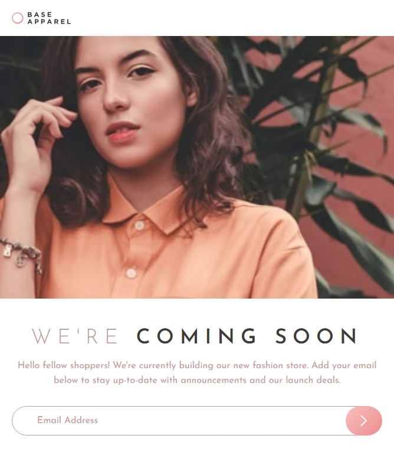
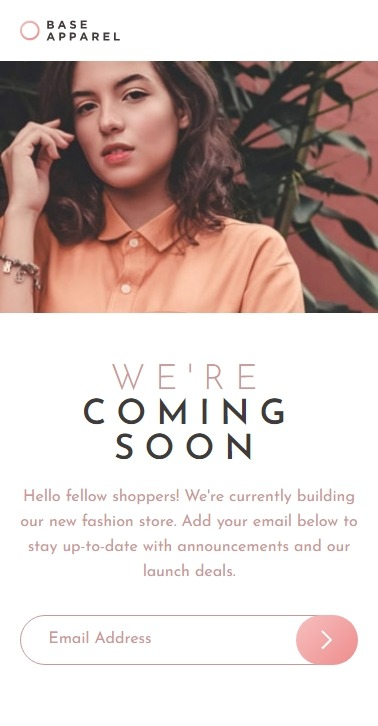

## Tabla de contenido

- [Resumen](#resumen)
  - [El reto](#el-reto)
  - [Captura de pantalla](#captura-de-pantalla)
  - [Enlaces](#enlaces)
- [Mi proceso](#mi-proceso)
  - [Construido con](#construido-con)
- [Autor](#autor)

## Visión general

### El reto

Los usuarios deben ser capaces de:

- Ver el diseño óptimo para el sitio según el tamaño de pantalla de su dispositivo
- Ver estados de desplazamiento para todos los elementos interactivos en la página
- Recibir un mensaje de error cuando se envía el `formulario` si:
  - El campo `input` está vacío
  - La dirección de correo electrónico no tiene el formato correcto

### Captura de pantalla

- Desktop

- Tablet

- Mobil

### Enlaces

- URL de la solución: [Repositorio GitHub]()
- URL del sitio en vivo: [Sitio en Netlify]()

## Mi proceso

### Construido con

- Marcado HTML5 semántico
- Propiedades personalizadas de CSS
- Caja flexible
- Cuadrícula CSS
- Flujo de trabajo móvil primero
- SASS
- Gulp

## Autor

- Frontend Mentor - [@Jean266](https://www.frontendmentor.io/profile/jean266)
- Twitter - [@JeanCar27866009](https://twitter.com/JeanCar27866009)